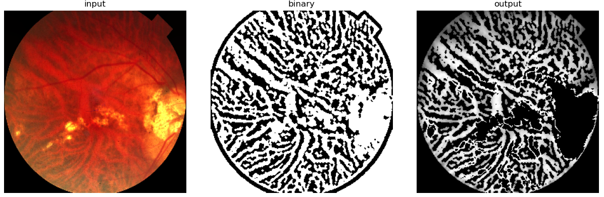
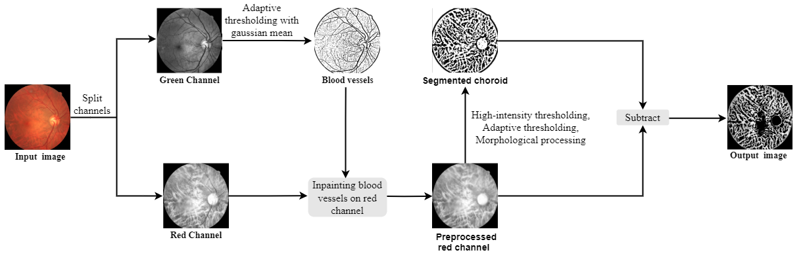

# Segmentation of Choroid tessellation and tubular structures 




## How it works




## Related works
- [Choroid thickness estimation paper with intensity thresholding approach](https://www.nature.com/articles/s41598-020-62347-7)


## Try it out
**1. Grab it**
You may grab the project folder
Use `requirements.txt` to setup your venv and then run `setup.py` 

```bash
pip install requirements.txt
python setup.py
```

**2. Use it**
The project does XYZ.
Here's a quick way to get started with it. 

```bash
### ===== 1. batch operation =====
## i. see config.py for settings 
## ii. run python on run.py 
python run.py 
```

```python
from tessellator import choroid_segment
### ===== 2. per file/request operations =========
## i. load a fundus RGB image 
fundus = choroid_segment.FundusImage( path_to_image )
## ii. get choroid segmentaiton results 
binary_step_img, final_output_img = fundus.choroid_tessellation
## or visualize results 
fundus.show_segmentation() 
## or save results to file 
fundus.save_segmentations() 
```


## Contributing
Pull requests are welcome. For major changes, please open an issue first to discuss what you would like to change.

Please make sure to update tests as appropriate.

## License
[MIT](https://choosealicense.com/licenses/mit/) 
